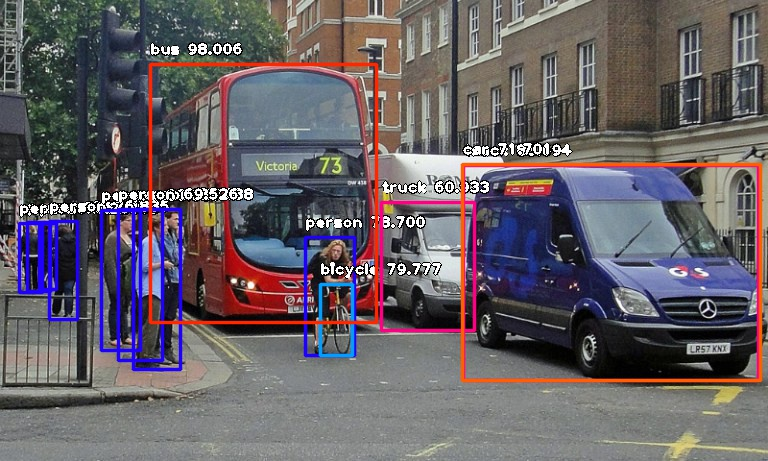

# Object Detection with 10 lines of code

Full article here: https://towardsdatascience.com/object-detection-with-10-lines-of-code-d6cb4d86f606 

## Installation : 
### Install Python : https://python.org

### Install Dependencies : 
`pip install tensorflow`
`pip install numpy`
`pip install scipy`
`pip install opencv-python`
`pip install pillow`
`pip install matplotlib`
`pip install h5py`
`pip install keras`
`pip install `https://github.com/OlafenwaMoses/ImageAI/releases/download/2.0.1/imageai-2.0.1-py3-none-any.whl`

### Download RetinaNet model file and place in the same folder
Download Here : https://github.com/OlafenwaMoses/ImageAI/releases/download/1.0/resnet50_coco_best_v2.0.1.h5

